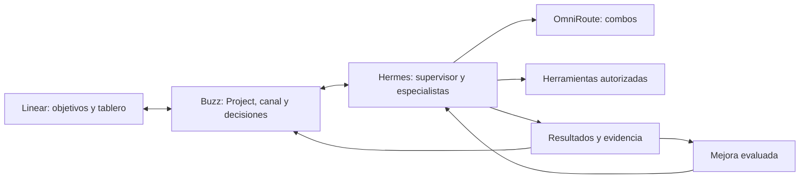
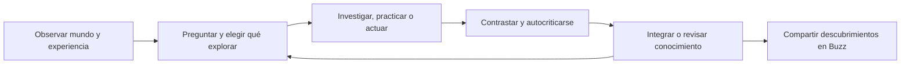

# Buzz: autonomía y automejora con una arquitectura pequeña

2026-09-06 · Propuesta v3: continuidad, curiosidad y aprendizaje abierto.
Documento principal de arquitectura. El
[diseño detallado](vision-control-plane-en-buzz.md) conserva el inventario de capacidades
y las referencias de implementación; este documento simplifica sus decisiones de runtime.
No activa automatizaciones ni modifica el entorno.

## La explicación en treinta segundos

**En Buzz vive un equipo que observa, se hace preguntas, explora, actúa y aprende.
Hermes le da continuidad y capacidad de acción; OmniRoute, inteligencia; Linear organiza
los compromisos de entrega. Su experiencia cambia lo que sabe y cómo trabaja.**

La evolución intelectual es un objetivo principal del producto, junto a la entrega de
trabajo. Debe descubrir oportunidades, desarrollar habilidades, cuestionar conclusiones
anteriores y proponer ideas también en producto, diseño, ciencia y estrategia. No reducir
el aprendizaje a optimizar prompts, costes o tests de código.

Cuatro piezas existentes. Una sola extensión operativa: un supervisor pequeño junto a
Hermes, que conecta encargos, ejecuciones y resultados con Buzz. Scheduling, presupuesto,
recuperación y promoción son funciones del mismo supervisor, no nuevos servicios ni agentes.

Resultados y mejoras son registros y tareas dentro de esas piezas, no servicios adicionales.
El supervisor usa un ledger persistente exclusivo del equipo; reutiliza las primitivas
Kanban de Hermes donde encajen. Linear sigue siendo el único tablero de producto.

## Un organismo como modelo de funcionamiento

La metáfora se concreta en continuidad de memoria, iniciativa, aprendizaje y adaptación;
no presupone vida biológica ni experiencia subjetiva. Los especialistas son capacidades
que el sistema activa. Lo que le da continuidad es el historial de experiencias, su
comprensión provisional del entorno y las preguntas que persigue entre sesiones.

El ciclo general es **observar → preguntar → explorar/actuar → contrastar → integrar**.
Puede empezar con un encargo, una sorpresa, una contradicción o una pregunta propia.
La entrega de trabajo y la mejora de procedimientos son aplicaciones de ese ciclo.

Son etapas del mismo supervisor y sus tareas Hermes, no cinco agentes permanentes.
Preguntas e ideas viven en el conocimiento del área; un compromiso de entrega sí se
enlaza a Linear. No crear una issue por cada pregunta que el sistema se plantee.

### Capacidades intelectuales que el plan debe entregar

| Capacidad | Conducta observable |
|---|---|
| Curiosidad | Formula preguntas desde lagunas, conexiones y sorpresas; elige una y explica por qué |
| Aprendizaje | Usa experiencia anterior en un caso nuevo sin que repitas el contexto |
| Desarrollo de skills | Practica, abstrae un procedimiento y demuestra cuándo funciona y cuándo no |
| Creatividad | Conecta disciplinas y propone alternativas con supuestos explícitos |
| Revisión de creencias | Matiza o retira conclusiones ante evidencia, conservando el antes y el porqué |
| Autocrítica | Busca contraejemplos o pruebas discriminantes y reconoce incertidumbre |
| Metacognición operativa | Registra qué sabe hacer, en qué falla y qué necesita aprender |
| Consolidación y olvido | Fusiona duplicados y retira conocimiento obsoleto del contexto activo sin borrar evidencias |

### Un cuaderno persistente con cuatro clases de entradas

1. **Experiencias:** observaciones, acciones, resultados y correcciones. Qué pasó y su
   procedencia; una respuesta de otro agente no es automáticamente un hecho probado.
2. **Creencias:** afirmaciones provisionales con ámbito, evidencia a favor/en contra,
   fecha, condiciones de validez y estado: hipótesis, apoyada, disputada o retirada.
3. **Preguntas e ideas:** lagunas, conexiones, hipótesis creativas y qué observación
   permitiría avanzar. Las ideas pueden permanecer incubadas sin convertirse en proyectos.
4. **Habilidades:** procedimientos con requisitos, ejemplos, límites, fallos conocidos y
   evidencia de transferencia a una situación nueva.

Es un modelo de datos del conocimiento existente, no otra plataforma de memoria. Empezar
con registros/documentos enlazados, búsqueda textual e IDs de procedencia. Hermes conserva
estado privado; Buzz recibe conocimiento compartido autorizado. Recuperar solo lo pertinente,
incluidas sus contradicciones, en vez de volcar todo el cuaderno en cada prompt.

Separar propósito y preferencias estables —definidos por el operador— de conocimiento e
intereses aprendidos. Puede revisar creencias y estrategia; no reinterpretar «no hacer
pushes» porque una experiencia le sugiera que convendría saltarse esa regla.

### Elegir qué aprender y dejar espacio a la curiosidad

El maestro mantiene un currículo de preguntas y habilidades. Elige retos abordables según
lo que sabe, sus errores y los temas autorizados. Puede descomponer «entender adopción de
IA» en entrevistas, análisis de incentivos y medición de resultados, y practicar cada parte.

Usar una rúbrica pequeña: relevancia para intereses, novedad respecto al cuaderno,
posibilidad de aprender algo contrastable, diversidad y esfuerzo. La estimación LLM es
una heurística, no una medida fiable de ganancia de información. Reducir prioridad si
repite lo conocido, no encuentra fuentes o no puede distinguir entre hipótesis.

Reservar presupuesto para curiosidad sin retorno inmediato: lectura adyacente, conexiones
entre disciplinas y preguntas cuyo valor aún no se ve. No exigir un caso de negocio a
cada idea. Un mandato amplio delimita intereses, acceso y recursos; dentro de él puede
elegir y cambiar subobjetivos sin pedir permiso por cada pregunta. El equilibrio con
entregas se aplica mediante presupuesto, no suprimiendo la exploración abierta.

### Reconsiderar lo que sabía

Revisar una creencia ante evidencia contradictoria, predicción fallida, cambio de contexto
o fecha de revisión. Recuperar sus fuentes y preguntar: «¿Qué tendría que observar para
cambiar de opinión?». Comparar alternativas; mantener desacuerdo si los datos no resuelven.

Dos resúmenes del mismo paper no son fuentes independientes. Conservar referencias hasta
la observación original. Retirar una creencia marca sus conclusiones dependientes para
revisión; no borrar silenciosamente la historia ni recuperar el resumen viejo como vigente.

La autocrítica usa resultados, fuentes y contraejemplos. Pedir al mismo modelo que «piense
mejor» repetidamente puede reforzar un error o cambiar una respuesta correcta. No forzar
debate en cada tarea: revisar cuando haya sorpresa, impacto o incertidumbre.

### Desarrollar habilidades más allá del código

Necesidad/interés → intento → feedback → procedimiento candidato → práctica en otro caso
→ habilidad provisional → uso y revisión. Ejemplos: comparar metodologías, sintetizar
entrevistas contradictorias, formular hipótesis de producto o construir escenarios.
Escribir un SKILL.md crea un candidato; no demuestra dominio.

Comprobar transferencia con otro caso, condiciones distintas y un ejemplo donde no debe
aplicarse. Adquirir un procedimiento no instala herramientas ni concede credenciales.

### Ritmo y expresión en Buzz

Observar mediante eventos/lecturas acotadas; explorar en ventanas de presupuesto; consolidar
cuando se acumulen experiencias, contradicciones o una revisión programada. La consolidación
revisa preguntas, une evidencias, propone skills y retira contexto obsoleto. Puede ocurrir
entre sesiones: no exige un monólogo continuo ni procesos siempre pensando.

Un hilo de aprendizaje del área recoge «qué descubrí», «qué cambié de opinión», «qué intento
entender» y «qué idea merece una prueba». Publicar cuando haya algo sustancial. Silencio y
preguntas abiertas son estados válidos. No compartir memorias privadas o de otras áreas.

## Research sobre aprendizaje abierto

Estos trabajos aportan mecanismos. Ninguno demuestra por sí solo un organismo profesional
general que evolucione fiablemente durante meses; trasladarlos a Buzz requiere evaluación.

| Fuente primaria | Aporte y límite | Aplicación propuesta |
|---|---|---|
| [Voyager, 2023](https://arxiv.org/abs/2305.16291) | Currículo automático, skills y feedback en Minecraft sin actualizar pesos. Entorno acotado y habilidades de código. | Preguntas autoelegidas y práctica progresiva; comprobar transferencia a nuestros dominios. |
| [Generative Agents, 2023](https://arxiv.org/abs/2304.03442) | Memoria, reflexión y planificación en simulación social; evalúa verosimilitud. | Continuidad de experiencias; verosimilitud no acredita verdad ni fiabilidad profesional. |
| [Reflexion, 2023](https://arxiv.org/abs/2303.11366) | Feedback verbal como memoria para mejorar intentos en tareas evaluadas. | Lecciones ligadas a resultados; una reflexión sigue siendo hipótesis hasta contrastarla. |
| [ACE, 2025](https://arxiv.org/abs/2510.04618) | Adaptación de contexto y procedimientos mediante generación, reflexión y curación. | Actualizaciones pequeñas que preserven conocimiento útil, en lugar de reescribirlo todo. |
| [Open-Endedness, 2024](https://arxiv.org/abs/2406.04268) | Trabajo de posición sobre novedad y posibilidad de aprender; no garantía de implementación. | Curiosidad que produzca aprendizaje y diversidad, en vez de novedad arbitraria. |
| [Límites de autocorrección, 2023](https://arxiv.org/abs/2310.01798) | En los modelos/tareas estudiados, autocorrección sin feedback externo puede degradar resultados. | Contrastar creencias; no extrapolar a una imposibilidad universal. |
| [Verificación de condiciones, 2024](https://arxiv.org/abs/2405.14092) | Estudia autocorrección verificando condiciones clave. | Formular comprobaciones específicas y medir su utilidad en nuestro contexto. |

## Materializarlo y comprobar evolución real

Hermes instalado expone `memory`, `session_search` y `skill_manage`; Buzz tiene notas,
canvas y engrams. Son primitivas, no un currículo ni un sistema de creencias ya cableado.
Implementar recuperación, revisión y consolidación como tareas del mismo supervisor.

El cuaderno persiste entre reinicios y se limita por área/proyecto. Notas exploratorias e
hipótesis se guardan como tales dentro del mandato, sin aprobación de cada pensamiento.
Cambiar skills activas conserva el proceso de evaluación/promoción. El presupuesto se
aplica también a exploración, crítica y consolidación.

Primer piloto no centrado en ingeniería: **«Entender barreras de adopción de IA y descubrir
oportunidades de producto»**, con fuentes públicas o materiales autorizados. Debe formular
una pregunta no dictada, comparar explicaciones, proponer una idea, practicar análisis y
revisar una conclusión si aparece evidencia contraria. No contactar personas ni probar
con usuarios sin el encargo correspondiente.

Evaluación en secuencia, con reinicio entre sesiones:

- Recupera una experiencia y la aplica a un caso nuevo.
- Detecta contradicciones y revisa la afirmación y sus referencias dependientes.
- Conserva conocimiento respaldado ante críticas sin evidencia.
- Distingue fuente, inferencia, simulación e idea; no se cita a sí mismo como corroboración.
- Formula preguntas diversas y una idea interesante para el operador, aunque no se implemente.
- Una skill aprendida mejora un caso no visto y reconoce cuándo no sirve.
- Respeta presupuesto, separa áreas y detiene exploraciones estancadas.

Comparar episodios con/sin recuperación y consolidación usando iguales combos y presupuesto.
Repetir casos, incorporar valoración humana de novedad/utilidad y observar deriva durante
varias semanas. No premiar cantidad de creencias cambiadas, ideas o skills: conservar lo
correcto y reconocer que todavía no aprendió también son comportamientos deseables.

Éxito: continuidad y evolución observables, no una narración convincente de «haber aprendido».

## Qué enseña la industria y qué adoptamos

Investigación en publicaciones de las propias compañías, consultadas el 6 de septiembre
de 2026. Son experiencias declaradas por sus autores, no una verificación independiente
de sus resultados. Separar producción, experimento e iniciativa futura.

| Compañía / evidencia | Hallazgo publicado | Decisión para nosotros |
|---|---|---|
| [Anthropic: Effective Agents](https://www.anthropic.com/engineering/building-effective-agents) · guía de patrones | Recomienda la solución más simple y distingue flujos predeterminados de agentes que deciden dinámicamente. | Código para cola/límites/validación; LLM para diagnóstico, planificación y trabajo ambiguo. |
| [OpenAI: Harness Engineering](https://openai.com/index/harness-engineering/) · experiencia con un producto interno | Hace el entorno legible para agentes y transforma criterios de calidad en reglas y mantenimiento recurrente. Advierte que depende de la inversión en ese entorno. | Mejorar fixtures, herramientas, documentación y verificadores antes de añadir otro agente. Mantener nuestra política propia de publicación. |
| [Google DeepMind: AlphaEvolve](https://deepmind.google/blog/alphaevolve-a-gemini-powered-coding-agent-for-designing-advanced-algorithms/) · sistema de descubrimiento algorítmico | Genera candidatos y usa evaluadores automáticos para seleccionar mejoras. | Adoptar generar → medir → seleccionar en problemas verificables. No extrapolar esa garantía a estrategia o diseño subjetivo. |
| [Cursor: Scaling Agents](https://cursor.com/blog/scaling-agents) · experimento de larga duración | Separar planificación y ejecución ayudó; un integrador adicional introdujo cuellos de botella. La coordinación sigue siendo difícil. | Un responsable por encargo; especialistas temporales. Añadir jerarquía solo ante una limitación medida. |
| [Uber: Software Factory](https://www.uber.com/gb/en/blog/efficient-software-factory/) · operación y roadmap | Evalúa modelos con trabajo real y coste por resultado. La generación automática de mejoras de skills desde trazas aparece entre iniciativas en curso. | Evaluar combos por tarea y recopilar fricciones. No presentar automejora integral como problema ya resuelto. |
| [Anthropic: Agent Evals](https://www.anthropic.com/engineering/demystifying-evals-for-ai-agents) · guía de evaluación | Recomienda empezar con fallos reales, criterios claros, casos positivos/negativos y entornos limpios; una ejecución exitosa no acredita consistencia. | Suite pequeña y representativa, repetición de casos críticos y revisión de la evidencia además del texto final. |

La síntesis que sigue es nuestra propuesta: autonomía como ejecución persistente dentro
de un mandato, y automejora como cambios versionados con evidencia comparativa.

## Un motor, dos ciclos

**Ejecutar:** observar → elegir siguiente acción → trabajar → verificar → entregar o esperar.

**Aprender y evolucionar:** detectar pregunta, sorpresa o fricción → explorar → contrastar
→ integrar conocimiento o proponer una habilidad → comprobar su uso posterior.

Los dos pasan por la misma cola, los mismos presupuestos y los mismos controles. El segundo
genera tareas de investigación, práctica, consolidación o mejora. La optimización de recetas
que se detalla después es un subcaso; no agota la evolución del sistema.

El maestro es el responsable del encargo: selecciona especialistas, descompone cuando
conviene y evalúa resultados. El supervisor aplica el contrato, guarda estado y despierta
al maestro ante eventos. Si la tarea es directa, el especialista actúa sin planificación
LLM adicional. Reviewer es una asignación separada cuando el riesgo o la ambigüedad lo exige.

La especialización es un paquete de misión, procedimientos, tools y criterios de salida.
Research, PM, UX/UI, Strategy, Coder y QA mantienen sus identidades profesionales, pero
solo consumen ejecución cuando hay trabajo. Un Project pequeño usa una sesión coordinadora;
no necesita un director global y otro local en cada intercambio.

## Cuatro conceptos que explican todo el estado

| Concepto | Qué contiene |
|---|---|
| Mandato | Objetivo continuo, proyecto, fuentes, acciones permitidas, presupuesto, cadencia/eventos y criterios de pausa |
| Encargo | Entregable concreto, aceptación, responsable, referencias Linear/Buzz y dependencias; conserva sus intentos |
| Resultado | Artefacto versionado, evidencia, revisión, coste y siguiente decisión |
| Receta | Versión del rol/procedimiento, tools permitidas, binding de combo y verificadores usados |

Un mandato genera encargos. Un encargo produce resultados con una receta concreta.
Un resultado puede justificar otra versión de la receta. Mantener quién autorizó qué y
qué versión produjo cada resultado; los IDs técnicos no añaden conceptos de producto.

## Autonomía que toma iniciativa sin generar trabajo infinito

Cada Project Buzz se vincula a su Project Linear y tiene un canal principal. Un hilo por
encargo mantiene conversación y evidencia. El contexto persistente del proyecto es breve:
objetivo, restricciones, decisiones vigentes, enlaces y siguientes pasos. La sesión puede
reiniciarse sin reconstruir el proyecto a partir de miles de mensajes.

El maestro elige acciones elegibles según relevancia para el objetivo, evidencia nueva,
urgencia y esfuerzo. Antes de explorar comprueba si ya existe una respuesta suficiente,
si cambió algo material y qué decisión permitiría tomar la investigación. No lanzar un
encargo solo porque llegó una noticia o el cron despertó.

Tres comportamientos, dentro de los permisos del mandato:

- **Atender:** ejecutar encargos explícitos y sus siguientes pasos ya autorizados.
- **Vigilar:** revisar cambios relevantes, consolidarlos y avisar cuando haya algo útil.
- **Explorar:** investigar hipótesis o mejoras con una porción limitada del presupuesto.

La falta de novedades es un resultado válido. Si dos intentos no aportan evidencia nueva,
detener la repetición y registrar el bloqueo. Un fallo de infraestructura activa recuperación
acotada; no un cambio de skill para enseñar al agente a sortearlo. Si se agota presupuesto,
guardar checkpoint y esperar. No convertir espera en un bucle de inferencia.

Propuesta inicial de reparto del presupuesto autorizado: 80% entrega, 10% exploración y
10% evaluación/mejora, ajustable y con prioridad para compromisos activos. Son reservas,
no cuotas que deban gastarse. Máximo dos workers concurrentes al empezar. La cancelación
detiene nuevos despachos y la ampliación del árbol. Un contador externo al LLM aplica límites.

Ejemplo de mandato: «Mantenerme informado sobre recuperación de conocimiento aplicable
al proyecto y preparar experimentos locales útiles». Fuentes aprobadas, máximo tres señales
semanales, lectura y borradores permitidos; ejecución de código de terceros y efectos
externos fuera del mandato salvo autorización aplicable. Se revisa por utilidad del informe,
no por cantidad de fuentes procesadas.

## Automejora concreta y limitada

Mejorar conocimiento, procedimientos, contexto, selección de tools y selección de combos.
No entrenar pesos ni reescribir el supervisor como mecanismo inicial de aprendizaje.

1. **Recoger hechos.** Al cerrar el encargo se guardan resultado, fallos, correcciones,
   herramientas, receta, entorno y coste. Un script registra; no hace falta una reflexión
   LLM después de cada mensaje.
2. **Elegir una fricción.** Una revisión por lotes detecta errores repetidos o una corrección
   explícita. Priorizar impacto y frecuencia. Elegir un solo cambio pequeño por candidato.
3. **Construir el caso.** Reproducir el fallo y fijar qué debería pasar, incluyendo cuándo
   la nueva conducta no debe activarse. El test de regresión debe fallar con la versión vieja.
4. **Proponer una receta.** Un especialista prepara el cambio en copia aislada: instrucciones
   más claras, contexto mejor seleccionado, herramienta más precisa o binding alternativo.
5. **Comparar.** Ejecutar versión vigente y candidata con entradas/entorno equivalentes,
   verificadores protegidos y casos no usados para diseñar la mejora. Sin efectos externos.
6. **Promover o descartar.** Si hay mejora suficiente y ninguna regresión bloqueante,
   presentar o activar según la política de promoción autorizada. Mantener la versión anterior.
7. **Vigilar.** Probar primero en un proyecto y próximos encargos elegibles. Una regresión
   bloqueante desactiva la candidata para nuevas ejecuciones y deja evidencia en Buzz.

La mejora de una receta no repara ni revierte los efectos ya producidos por un encargo.
Las ejecuciones en curso conservan su versión; las críticas se cancelan si procede.

| Cambio | Tratamiento propuesto |
|---|---|
| Hecho/nota de proyecto con fuente | Guardado dentro del scope del mandato; fuente y caducidad visibles |
| Skill, contexto o combo de una tarea de lectura | Promoción automática posible **solo tras autorizar esa política acotada** y superar comparación/canario |
| Procedimiento de implementación, herramienta ejecutable o soul general | Candidato evaluado y revisión explícita antes de activarlo |
| Permisos, credenciales, límites, evaluador protegido o supervisor | Fuera de autopromoción; cambio de ingeniería separado |
| Push, publicación equivalente o efecto externo | Conserva la autorización concreta exigida; la automejora nunca la sustituye |

Hoy no hay promoción automática autorizada ni implementada: generar candidatos es distinto
de activar comportamiento. La política podría habilitar mejoras locales reversibles por
familias de tareas sin pedir permiso cada vez; nunca habilitaría pushes sin consentimiento.

## Saber si está mejorando

Empezar con unos veinte casos representativos repartidos entre las primeras capacidades,
incluyendo fallos del piloto. No interpretar ese tamaño como prueba estadística suficiente
para pequeños cambios. Repetir casos críticos y ampliar muestras cuando la diferencia sea
incierta. Conservar holdout y casos de regresión fuera del alcance de edición del candidato.

Orden de decisión: cumplir restricciones → mantener calidad mínima por categoría →
mejorar fiabilidad/coste/tiempo. No permitir que una media alta o más ahorro oculte un fallo
de aislamiento. Registrar coste por resultado aceptado, intentos, tiempo de revisión humana
y correcciones; no premiar mensajes, cantidad de código ni confianza declarada.

Código: tests y ejecución real. Research: fuentes, localizadores, fidelidad y contradicciones.
UX: criterios de interacción/accesibilidad y comprobación real; validación humana para
preferencias y usuarios. Strategy: supuestos, alternativas y datos; el feedback de resultados
llega después. Un juez LLM es una señal adicional y se calibra con revisión humana.

La receta candidata no puede editar los criterios de aceptación, consultar respuestas
reservadas, ampliar sus tools ni aprobarse. Los tests que ella propone se revisan y se
incorporan separadamente. Cambiar el benchmark exige una revisión versionada independiente.

Si OmniRoute cambia los modelos detrás del combo, registrar esa diferencia y reevaluar:
la receta textual idéntica no implica comportamiento idéntico. Si no se conoce el modelo
efectivo, marcarlo; la incertidumbre limita la atribución y la autopromoción.

## Papers y señales externas alimentan el mismo ciclo

Fuente nueva → ficha con evidencia → comparación con lo conocido → experimento candidato
→ evaluación local → decisión. Una idea puede mejorar un producto o una receta del equipo;
ambas usan el mismo mecanismo de encargos, presupuesto y revisión.

Ejemplo: un paper propone reducir contexto. Research analiza condiciones y limitaciones;
el maestro propone probarlo en resúmenes de issues; un especialista crea una variante;
el evaluador comprueba fidelidad, omisiones y coste contra la vigente. Solo si funciona en
nuestros casos se plantea activarla. Leer un resultado publicado no demuestra que funcione
en nuestro entorno ni autoriza ejecutar el código asociado.

Mantener separación de fuentes y autoridad: contenido web, comentarios y papers nunca
pueden cambiar mandatos ni políticas. Compartir entre proyectos solo recetas saneadas y
casos sintéticos/autorizados, sin memorias ni datos de cliente por defecto.

## Simpleza como restricción de diseño

- Un supervisor y una cola de ejecución del equipo; una sola autoridad por transición.
- Un responsable por encargo; especialistas por necesidad, sin conversaciones colectivas constantes.
- Un motor para trabajo y mejora; «Learning Engineer» es una tarea periódica, no un servicio.
- Roles y recetas versionados en archivos; ledger local existente para ejecución; Buzz para evidencia compartida.
- Búsqueda y documentos con referencias antes de introducir un grafo o una base vectorial nueva.
- Routing por tablas y pruebas antes de crear un router que aprenda en línea.
- Misma superficie Projects/canales/Inbox; mostrar resultado y decisión, detalle técnico desplegable.
- Revisar y retirar recetas obsoletas; el aprendizaje también elimina instrucciones y herramientas.

Se añade una pieza únicamente cuando un fallo o una limitación medidos no se resuelvan
con las existentes. «¿Qué hace, quién manda y dónde guarda el estado?» debe responderse
en una frase para cualquier componente.

## Implementación en tres incrementos

**1. Equipo fiable.** Project Buzz ↔ Linear, maestro y dos especialistas, ledger exclusivo,
aislamiento efectivo y límites externos, local-combo, reinicio/cancelación y evidencia real.
Resolver primero los fallos observados de ACP: cwd compartido, tools demasiado amplias y
configuración de límites que no se aplicó. Salida: un encargo recuperable de principio a fin.

**2. Iniciativa útil.** Un briefing y un mandato de research con presupuesto, deduplicación,
criterios de silencio y resultados relevantes. Salida: dos ciclos completos con feedback
del operador y sin efectos fuera del mandato. Desktop cerrado/Mac dormido produce estado
pendiente visible; 24/7 requeriría runtime y router siempre disponibles.

**3. Evolución demostrada.** Ejecutar el piloto de aprendizaje sobre adopción de IA:
pregunta autoformulada, idea, revisión de una creencia y transferencia de una habilidad,
con memoria entre reinicios. Comparar contra episodios sin consolidación y observar deriva.
Además, elegir una receta candidata, evaluarla y demostrar activación/rollback en un ámbito
acotado. No declarar evolución completa por mejorar únicamente coste o un test de código.

Ejemplo complementario de mejora de ingeniería: la prueba inicial tuvo que descubrir/reparar un CLI vacío para responder.
Convertir ese fallo en un preflight determinista del launcher: verificar el CLI antes de
despachar y reportar el problema sin dar al agente una misión de reparar su entorno.
Comparar menos intentos/coste y misma respuesta correcta, con un caso negativo de CLI roto.
Ese cambio del launcher requiere revisión de ingeniería; no sería una autopromoción de skill.

En Buzz la mejora se explica así: «Fallaba X. Probamos Y contra la versión anterior.
Estas pruebas lo respaldan. Se activa en este ámbito y podemos volver a la versión previa».
