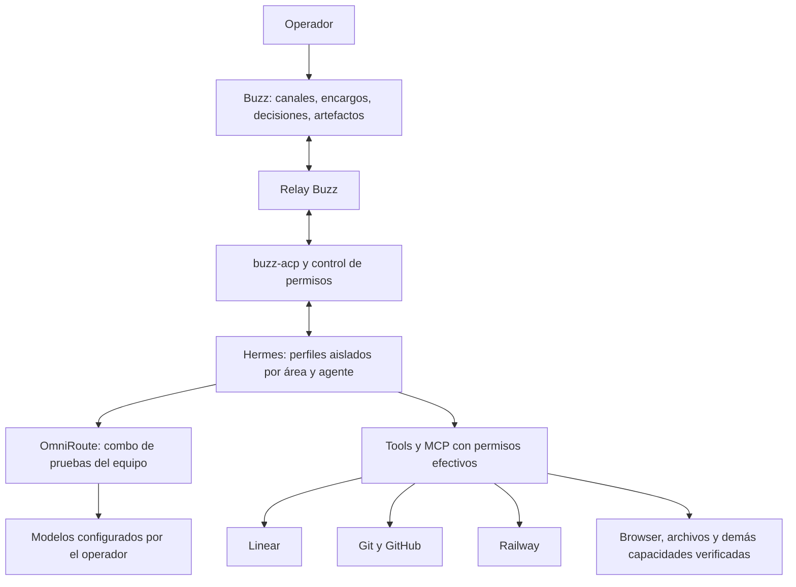

# Plan: equipo de producto y software en Buzz con Hermes y OmniRoute

Arquitectura vigente: [autonomía y aprendizaje abierto v3](arquitectura-autonomia-buzz.md).
Curiosidad, creatividad, desarrollo de habilidades, autocrítica y revisión de creencias
son objetivos centrales, junto a la entrega. Un supervisor sostiene ejecución y aprendizaje.

Fecha: 2026-09-06. Estado: plan inicial con piloto de conexión completado; equipo pendiente.

La [visión operativa ampliada](vision-control-plane-en-buzz.md) concreta Projects de Buzz
vinculados a Linear, maestro/especialistas, routing por combos, autonomía, papers y reporting.
Incorpora los hallazgos posteriores y la preferencia de mantener Linear como tablero.

Actualización posterior: se realizó una prueba de integración desde la aplicación real.
Véase [validación Buzz–Hermes](buzz-hermes-live-validation.md) para el recorrido, los
recursos de prueba creados, respuesta y lectura verificadas con `local-combo`, y los
límites de permisos observados. El resto del equipo y las
fases de permisos siguen pendientes; la conexión ACP no equivale a completar el plan.

## Resultado buscado

Operar desde Buzz un equipo que convierte ideas, reuniones, problemas y encargos en
investigación, decisiones de producto, diseños, software probado e informes de impacto.
El operador puede encargar trabajo al coordinador o a cualquier especialista, intervenir,
corregir y decidir. Hermes ejecuta con las capacidades existentes; OmniRoute resuelve los
modelos mediante un combo específico que el operador conectará después.

La integración preserva el Hermes actual: memoria, sesiones, gateways, automatizaciones,
perfiles y configuración de routing existentes. El equipo nuevo tiene estado independiente.
La conectividad técnica no amplía permisos. Cada push exige consentimiento explícito para
ese push, también si se publica mediante una API o una herramienta intermediaria.

## 1. Hallazgos que condicionan la ejecución

Hallazgos iniciales de revisión estática del checkout local de Buzz y Hermes instalado.
Después se verificaron conversación y lectura con `local-combo`; la autenticación y
paridad del resto de conectores todavía no están probadas en este piloto.

| Hallazgo | Consecuencia |
|---|---|
| Buzz ya ofrece el preset Hermes mediante `hermes-acp`, y admite harnesses personalizados. | Probar primero la integración ACP existente; un puente nuevo no es el punto de partida. |
| Buzz inyecta por defecto `HERMES_ACP_SKIP_CONFIGURED_MCP=1`. | Verificar si la versión instalada lo interpreta y cómo carga MCP en ACP. No suponer que Linear y otros conectores llegan al agente. |
| `buzz-acp` responde automáticamente `allow_once` a peticiones de permiso ACP. | Es una brecha real respecto al consentimiento requerido; cerrar antes de acciones externas. |
| Los workflows tienen piezas de suspensión, pero `finalize_run` marca las aprobaciones como `approval_not_supported`. | No considerar el botón de aprobación una garantía de ejecución suspendida y reanudable. |
| Hermes separa estado con `HERMES_HOME`; su clonación también copia `MEMORY.md` y `USER.md`. | Crear perfiles limpios e importar capacidades selectivamente. |
| Los procesos locales de Hermes conservan acceso de usuario al filesystem y credenciales de CLI. | Un perfil no es un sandbox. El aislamiento de acceso requiere una frontera adicional. |
| Inventario preliminar: el perfil principal declara un MCP llamado `linear` y contiene 110 archivos `SKILL.md`. | Es una base candidata; nombres y archivos no prueban acceso efectivo. Railway queda pendiente de inventario y prueba. |
| El fork aporta perfiles/evals, biblioteca de skills y previews de artefactos y dev servers. | Reutilizar estas superficies para configurar y evaluar al equipo. |

Fuentes locales: `crates/buzz-acp/README.md` (BYOH),
`desktop/src-tauri/src/managed_agents/discovery/presets.rs`,
`crates/buzz-acp/src/config.rs::default_agent_env`,
`crates/buzz-acp/src/acp.rs::handle_permission_request`,
`crates/buzz-workflow/src/lib.rs::finalize_run`;
Hermes: `hermes_cli/profiles.py`, `acp_adapter/session.py`, `acp_adapter/permissions.py`.
La documentación oficial confirma que los perfiles separan estado, pero no restringen
filesystem: https://hermes-agent.nousresearch.com/docs/user-guide/profiles/.

## 2. Qué se conserva de control_plane y qué cambia

La referencia es el proyecto hermano `control_plane`, especialmente su plan de visión,
`md.md` y los ADR 0006 y 0009. Sus notas históricas sobre servicios caídos no son un
diagnóstico del estado actual.

| Visión de control_plane | Materialización propuesta en Buzz |
|---|---|
| Encargar, revisar, corregir y aprobar | Conversación en hilos + bandeja de decisiones con propuestas concretas. |
| Overview de tareas y dependencias | Proyección de encargos, responsables, bloqueos y resultados verificables. |
| Briefing diario y revisión de repos | Agentes publican resúmenes con evidencia y próximos pasos en canales del área. |
| Ideas desde URLs, lectura y reuniones | Research + Innovation producen oportunidades y experimentos trazables. |
| Crear proyectos de principio a fin | Flujo de discovery, producto, diseño, implementación, validación y entrega revisable. |
| Apoyo como Head of AI | Auditorías de prácticas y puntos ciegos, métricas DX e informes de impacto por periodo. |
| Capacidades y políticas por área | Registro de capacidades, scopes, límites y credenciales por área y perfil. |
| Memoria, correcciones y versiones del soul | Memoria privada por perfil; conocimiento compartido explícito y versionado por área. |
| Costes, modelos y latencia | Trazas reales de Hermes/OmniRoute correlacionadas con cada ejecución. |
| Datos obsoletos y motor caído visibles | Edad de la última señal, cola persistente y estados desconocido/desconectado. |
| Acceso remoto sin ingress al Mac | Workers conectados de salida al relay Buzz; sin publicar una API de Hermes. |

Decisión de arquitectura: para este equipo, Buzz sustituye la combinación dashboard +
Telegram + commits de transporte de control_plane. No se necesita un push periódico para
transportar tareas o aprobaciones. El sistema anterior continúa funcionando aparte.

Tensión consciente con la visión de Buzz como workspace autosuficiente: se conservan
Linear, GitHub y Railway como sistemas especializados porque el operador quiere mantener
sus capacidades. No se migra el código a la forge de Buzz para poder empezar.

## 3. Arquitectura y autoridades

OmniRoute enruta inferencia. Las llamadas a Linear, Railway y otras herramientas las
ejecuta Hermes mediante sus tools/MCP; no se convierten en tráfico de modelos.

Autoridades explícitas:

- Buzz: encargos, conversación, decisiones del operador y evidencia compartida.
- Hermes: ejecución, estado de sesión y memoria privada del agente.
- Linear: backlog y estado de entrega cuando el proyecto ya usa Linear; Buzz muestra y
  enlaza ese estado. Una tarea de ejecución tiene su propio `run_id`, no otro ticket rival.
- Git: código y versiones; GitHub conserva PRs y revisiones si el proyecto lo utiliza.
- Railway: verdad sobre servicios, entornos y despliegues.
- Registro existente de proyectos: conservar `projects.yaml`; añadir un mapa de IDs Buzz,
  Linear y área, sin crear un segundo catálogo de proyectos.

Propuesta de identidad correlacionada: `area_id`, `project_id`, `task_id`, `run_id`,
`parent_run_id`, `agent_id`, `buzz_thread_id`, `linear_issue_id` opcional.
Cada evento conserva fuente y fecha; un reinicio no debe duplicar un efecto externo.

## 4. Aislamiento de Hermes y conservación de capacidades

1. Inventariar el perfil de referencia: skills, tools nativas, MCP, hooks, proveedor,
   auth por referencia, comandos externos, permisos y rutas de escritura. No exportar
   secretos ni transcripciones. Registrar por capacidad: configurada, autenticada,
   disponible en ACP y validada con una operación representativa.
2. Crear un perfil limpio por agente y área: nombres propuestos
   `buzz-<area>-coordinator`, `buzz-<area>-coder`, `buzz-<area>-qa`, etc.
   Ningún proceso concurrente comparte el mismo home. Empezar con una ejecución activa
   por perfil; ampliar concurrencia únicamente con homes distintos.
3. Importar copias versionadas de skills y configuración pertinente. Revisar scripts con
   rutas absolutas a `~/.hermes`, bases de datos comunes, `~/Brein` o cron del Personal OS.
   No copiar memoria, sesiones, cron, tokens de bots ni hooks automáticamente.
4. Preservar el catálogo de capacidades del Hermes de origen, distribuyéndolo por rol.
   Si un especialista necesita otra capacidad, la obtiene dentro del scope ya autorizado
   o deriva el paso al perfil que la tenga. Las ausencias se hacen visibles.
5. Configurar explícitamente `HERMES_HOME`, directorio de trabajo y entorno de lanzamiento.
   No cambiar el perfil activo global ni el modelo por defecto del Hermes existente.
6. Separar cachés de tokens y configuración mutable de CLI. Reutilizar el acceso vigente
   por referencias controladas; comprobar scopes reales sin copiar todo el almacén de auth.
   Evitar operaciones como `railway link` que cambien el destino implícito: usar IDs de
   proyecto, entorno y servicio.
7. Para cumplir aislamiento de acceso, evaluar un sandbox compatible con ACP y las tools:
   workspace montado para escritura, skills de solo lectura, credenciales necesarias y
   ausencia de acceso a homes ajenos. Un `cwd` o una instrucción en el soul no lo garantiza.
8. Probar no contaminación con datos señuelo: memoria, búsqueda, escritura, acceso de tools,
   tokens y automatizaciones. Tomar una línea base de configuraciones existentes; distinguir
   cambios legítimos de procesos ya activos de cambios hechos por la integración.

Separación de áreas: trabajo, personal y universidad no comparten memoria ni credenciales
por defecto. Usar comunidades distintas cuando se necesite frontera de tenant y canales
privados por proyecto dentro de cada comunidad. Un coordinador agregado solo recibe
resúmenes expresamente compartidos entre áreas.

## 5. Equipo y entregables

Los roles son contratos de trabajo evaluables; no implican mantener todos los procesos
encendidos. Inicialmente arrancan bajo demanda y con concurrencia global baja.

| Perfil | Responsabilidad y salida exigida |
|---|---|
| Coordinator / Delivery Lead | Convierte el encargo en tareas, asigna responsables, controla dependencias, resume y escala decisiones. No se concede permisos. |
| Product Lead / PM | Problema, usuarios, objetivos, alcance, PRD, prioridades, criterios de aceptación y métricas de éxito. |
| Innovation Lead | Oportunidades desde research y reuniones, hipótesis, portfolio de experimentos, criterio de continuar o descartar. |
| Technology Strategy Consultant | Diagnóstico, alternativas build/buy/partner, operating model, escenarios de coste, roadmap y memo ejecutivo con supuestos. |
| Research / Discovery | Evidencia citada, entrevistas o transcripciones autorizadas, competencia, tendencias, incertidumbres y síntesis. |
| UX Research / UX Design | Flujos, arquitectura de información, escenarios, prototipos y plan de validación con usuarios. |
| UI / Product Designer | Pantallas, estados vacíos/error/carga, responsive, accesibilidad y especificación de interacción. |
| Visual / Brand Designer | Dirección visual, activos, consistencia y materiales de presentación. |
| Tech Lead / Architect | Diseño técnico, ADRs, fronteras, riesgos, descomposición y revisión de decisiones de implementación. |
| Coder | Implementación en worktree propio, pruebas pertinentes, diff y entrega lista para revisión. Especializaciones frontend/backend/mobile según encargo. |
| Code Reviewer | Revisión independiente de comportamiento, mantenibilidad y regresiones; no autoacepta trabajo propio. |
| QA Automation | Estrategia de pruebas por riesgo, automatización y evidencias reproducibles. |
| Manual / Exploratory Tester | Recorre la app real con navegador/dispositivo, reproduce fallos y adjunta pasos, esperado/observado y capturas. Identifica pruebas que necesitan una persona. |
| Platform / DevOps / SRE | Diagnóstico de Railway e infraestructura, observabilidad, propuestas de despliegue y rollback dentro del permiso vigente. |
| Security / Privacy Reviewer | Revisión de scopes, secretos, límites entre áreas y amenazas concretas del cambio. |
| Product Analytics / Impact | Instrumentación, adopción, DX, resultados por periodo y evidencia para reporting ejecutivo. |

Cada perfil define misión, entradas, salidas, herramientas, límites, criterios de terminar,
handoffs y ejemplos de buena ejecución. El coordinador selecciona el equipo necesario;
una consulta estratégica no pasa obligatoriamente por Coder y QA.

## 6. Forma de trabajar desde Buzz

Canales propuestos por área: `#control`, `#briefings`, `#innovation`, `#strategy`,
`#decisions` y uno por proyecto. Un hilo por encargo conserva propuesta, cambios de alcance,
delegaciones, evidencias y cierre. Puedes mencionar directamente a cualquier especialista.

Flujos iniciales:

- Software: encargo → PM/discovery → UX/UI → arquitectura → Coder → review independiente
  → QA automática y exploratoria → paquete de entrega → publicación autorizada.
- Innovation: fuente o idea → research → hipótesis → diseño de experimento → prototipo
  → evidencia → decisión de continuar/descartar.
- Consultoría: pregunta ejecutiva → fuentes autorizadas → diagnóstico → alternativas
  → recomendación, roadmap y métricas → revisión del operador.
- Operación: briefing → cambios y bloqueos por proyecto → próximos pasos; auditorías
  periódicas de prácticas, puntos ciegos y reporte de impacto bajo demanda.

Contrato de encargo: objetivo, área/proyecto, contexto, entregable, criterios de aceptación,
responsable, dependencias, plazo si existe, presupuesto y permisos aplicables.

Estados propuestos: `queued`, `running`, `waiting_dependency`, `waiting_operator`,
`blocked`, `completed`, `failed`, `cancelled`. Distinguir tarea terminada de sesión cerrada.
Los agentes delegan mediante tareas explícitas con destinatario y evidencia esperada;
limitar profundidad, reintentos y concurrencia para impedir bucles de menciones.

## 7. Permisos: conservar la autoridad existente

Permiso efectivo = intersección del acceso del operador, política vigente del área,
capacidad del rol, scope de herramienta y autorización concreta cuando corresponda.
Una credencial capaz de desplegar no equivale a un encargo que autoriza desplegar.

El ADR 0006 de control_plane declara merge, deploy y configuración de sistemas prohibidos.
La petición actual dice mantener permisos existentes, por lo que el plan no eleva esos
techos. En la fase de inventario se compara esa política con la configuración efectiva:
si una prohibición sigue vigente se conserva; una excepción requiere decisión expresa.
Las lecturas y el trabajo local ya autorizado no necesitan aprobaciones repetidas.

Implementación necesaria antes de habilitar efectos:

- Sustituir la autoaprobación ACP en este modo por una decisión de política. Las peticiones
  que requieren intervención quedan persistidas y visibles al operador autenticado.
- Vincular cada aprobación a acción, destino, payload/diff, revisión, área, caducidad e ID
  de uso único. Editar la propuesta invalida la aprobación anterior.
- Admitir aceptar, rechazar/ignorar, editar y responder; distinguir pregunta de notificación.
- Mantener el mismo control en shell, MCP y APIs. Filtrar solo `git push` no impediría que
  una tool publique el mismo cambio por GitHub; las credenciales de escritura se exponen
  solo a la operación autorizada, no a una shell sin restricciones.
- Aplicar la política también a tools que no solicitan permiso ACP. La aprobación ACP
  por sí sola no es un control universal de herramientas.
- Elegir un único ciclo persistente de propuesta/decisión/ejecución. Completar y probar
  la persistencia/reanudación de workflows si se reutiliza; no crear dos colas competidoras.
- Parada inmediata: impedir nuevos despachos y cancelar procesos activos; declarar qué
  efectos ya ocurrieron. No prometer deshacer un correo, push o despliegue ya realizado.

La primera prueba con capacidades externas será de lectura. La ejecución completa no se
declara lista hasta que se pruebe el rechazo real de acciones no autorizadas.

## 8. OmniRoute y evaluación de combos

Preparar un binding exclusivo para el equipo con endpoint, referencia de autenticación y
alias de combo elegidos por el operador. Los nombres son configuración; no fijar modelos
comerciales ni modificar las rutas de otros perfiles.

Verificar compatibilidad de API, streaming, tool calls, JSON estructurado, visión si se
utiliza y cancelación. Revisar también modelos auxiliares, compresión y subagentes:
ninguna llamada de inferencia debe escapar a OmniRoute por un default heredado.
Para salidas estrictas, conservar la regla existente de no comprimir si rompe el contrato.

Sin combo configurado, la tarea muestra `routing_not_configured`. Si el combo falla,
registrar el fallo y aplicar solo fallback declarado dentro de OmniRoute; no saltar a
credenciales directas de otro proveedor. Probar caída, timeout y límite de cuota.

Guardar por run: alias y versión/configuración del combo cuando estén disponibles, modelo
efectivo si lo informa el router, tokens, coste conocido o desconocido, duración y errores.
No inferir coste cero de datos ausentes. Evaluar calidad junto a coste y latencia.

## 9. Fases ejecutables y criterios de salida

| Fase | Trabajo | Criterio para avanzar |
|---|---|---|
| 0. Inventario y contratos | Confirmar perfil fuente, comunidad/área de piloto, capacidades, políticas y fuentes de verdad; registrar baseline y plan de rollback. | Matriz de paridad y permisos, sin secretos, con huecos explícitos. |
| 1. Hermes aislado + ACP | Crear un perfil de prueba limpio, configurar lanzamiento, verificar handshake, toolsets/MCP y shell aislada. | Conversación y tool de lectura desde Buzz; no contaminación demostrada; parar/reiniciar funciona. |
| 2. Control de ejecución | Cerrar autoaprobación, exposición de credenciales, bandeja persistente, reanudación, idempotencia y cancelación. | Acciones sin consentimiento rechazadas; aprobación concreta funciona una vez y sobrevive a reinicio. |
| 3. Conectar combo | Incorporar binding cuando el operador lo facilite; verificar inferencia y auxiliares. | Tráfico solo por OmniRoute, fallos visibles y métricas reales. |
| 4. Equipo piloto | Coordinator, Product Lead, Coder, QA y tester exploratorio; probar después un encargo con UX/UI. | Encargo real completo hasta entrega local revisable, evidencia de QA y retorno de correcciones. |
| 5. Producto y estrategia | Añadir Innovation, Research, Strategy, Design, Architecture, Platform e Impact; perfiles según necesidad. | Un caso de software, uno de discovery/innovation y uno de consultoría aceptados por el operador. |
| 6. Control plane completo | Overview, filtros guardados, versiones de perfiles/soul, correcciones, briefings, costes, presupuestos y auditorías. | Se puede supervisar y decidir desde Buzz sin reconstruir el estado leyendo todos los chats. |
| 7. Operación sostenida | Activar solo las cadencias autorizadas, límites por área, recuperación y pruebas de acceso remoto si se requieren. | Piloto de varios días sin duplicados, contaminación ni acciones fuera de permiso. |

Dependencias: 0 → 1 → 2; la fase 3 puede prepararse con 1, pero el operador proporciona
el combo. El piloto de ejecución requiere 2 y 3. No hace falta desplegar Hermes remoto
ni migrar control_plane para validar el primer caso.

Paquetes de implementación propuestos, cada uno revisable por separado:

1. Manifiesto de equipo, inventario de capacidades y bootstrap idempotente de perfiles.
2. Integración ACP y pruebas de paridad de herramientas.
3. Política de permisos y ciclo completo de aprobación/ejecución.
4. Contrato de tareas, delegaciones, reintentos y trazabilidad Linear/Buzz.
5. Perfiles y evals de los tres flujos piloto.
6. Superficies de supervisión, telemetría y automatizaciones optativas.

En Buzz, añadir operaciones agent-facing primero a `buzz-cli` y usar eventos Nostr y
scoping existente. Si se necesitan nuevos kinds, registrarlos en `buzz-core` y probar
autorización/aislamiento del relay. Respetar runtime metadata canónica del editor de
agentes, resets de comunidad y las funciones adicionales de buzz-v1.

## 10. Validación y definición de listo

- Aislamiento: perfil A no recupera memoria/sesiones de B ni puede escribir sus archivos;
  skills importadas no modifican los crons o el estado del Personal OS.
- ACP: conectar, mencionar, responder en el hilo correcto, usar una tool, cancelar,
  reiniciar y recuperar; fallo de MCP no se convierte en silencio o falso éxito.
- Permisos: denegar push por shell y API, deploy/config prohibidos, aprobación caducada,
  cambio de diff, decisión duplicada y aprobación emitida por otro agente.
- Routing: tool calls y auxiliares por el combo; caída sin fallback externo; costes
  desconocidos etiquetados; límites de ejecución efectivos.
- Equipo: delegación sin loops; revisión independiente; el tester usa la app real y
  reporta entorno y evidencia. Un screenshot mock no demuestra que Hermes esté conectado.
- Reinicios: no duplicar tickets, publicaciones ni comandos ya ejecutados; reconciliar
  acciones de resultado incierto antes de reintentarlas.
- Producto: briefing útil, prototipo comprobable y memo estratégico con fuentes y
  supuestos. Medir aceptación, correcciones, regresiones, tiempo y coste por resultado.
- Regresiones de Buzz: tests de la zona modificada, smoke de previews/skills/perfiles/evals,
  y `just ci` antes de PR. Integración de relay/DB/auth con Postgres y Redis si se modifican.

Rollback: parar exclusivamente workers `buzz-*`, deshabilitar su binding y automatizaciones,
preservar sus evidencias y retirar sus registros de Buzz. Los perfiles y servicios previos
no se restauran a ciegas ni se sobrescriben. Los efectos externos, si los hubo, tienen su
propio procedimiento; no se consideran reversibles por borrar el perfil.

## 11. Datos que se resuelven al comenzar la implementación

- Perfil de referencia: provisionalmente Hermes principal; pendiente de respuesta del operador.
- Comunidad del piloto: Sapira existente, sin modificar sus ajustes; Project Buzz vinculado
  al proyecto de Linear como unidad de colaboración.
- Proyecto y encargo piloto: escoger un caso pequeño y representativo con criterios de aceptación.
- Combo de prueba: `local-combo` validado. Los bindings de las clases de servicio a otros
  combos se decidirán mediante evaluación; no se han configurado.
- Políticas contradictorias entre documentos y runtime: presentar diferencias concretas,
  conservar el límite más restrictivo hasta una decisión explícita.

Este documento prepara la implementación del equipo. El agente de prueba creado y sus
resultados están descritos en la validación enlazada. La exploración posterior no activa
crons, escribe en Linear/Railway ni publica cambios.
