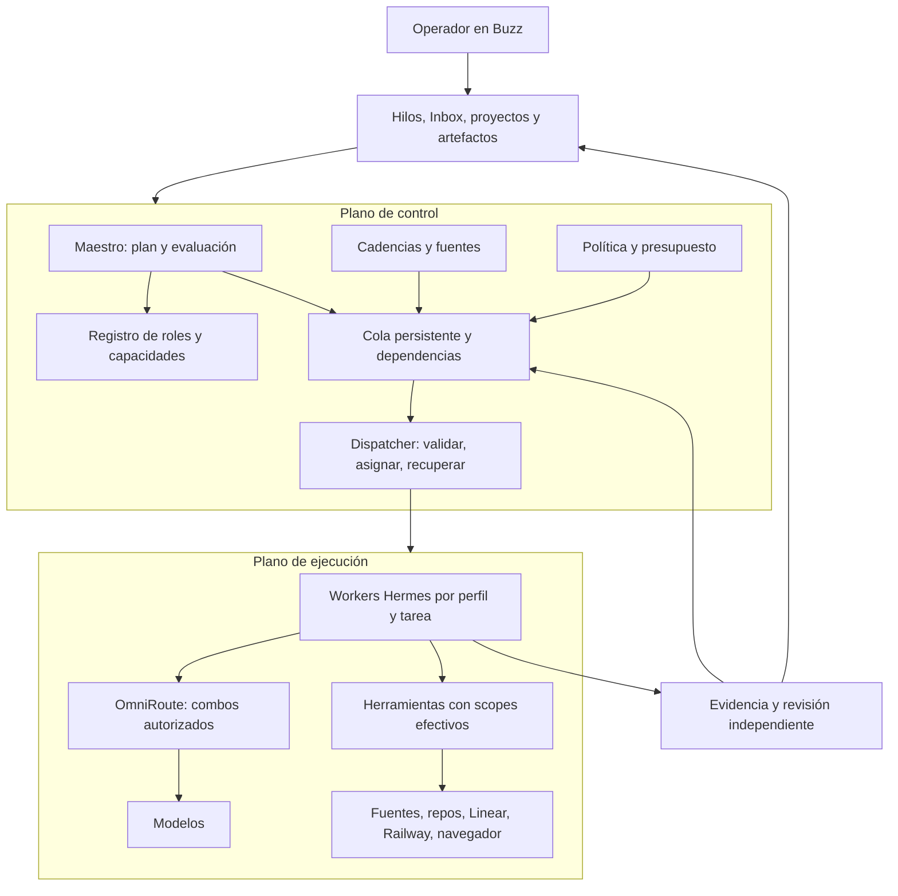

# Visión operativa de control_plane en Buzz

La [arquitectura v3 de autonomía y aprendizaje abierto](arquitectura-autonomia-buzz.md)
es la entrada principal: un supervisor, especialistas bajo demanda y continuidad de
experiencias, creencias, preguntas y habilidades. Curiosidad y evolución intelectual
son objetivos centrales. Este documento conserva el detalle de roles e integración.

Fecha: 2026-09-06. Estado: exploración y diseño; no activa agentes, automatizaciones ni
configuración. Complementa el [plan inicial](plan-control-plane-buzz.md) y se apoya en la
[prueba real con Hermes y local-combo](buzz-hermes-live-validation.md).

## 1. Decisión propuesta

Buzz será el lugar donde encargas, supervisas, corriges y recibes el trabajo. Un agente
maestro coordinará especialistas, pero el estado, la cola, los permisos y los presupuestos
vivirán fuera de su conversación. Hermes será el runtime; OmniRoute elegirá los modelos
dentro de combos autorizados. El equipo tendrá su propio estado operativo.

El resultado debe cubrir las seis capacidades originales: briefing diario, construcción
de software desde una idea, iniciativa desde lecturas y reuniones, mejora de repositorios,
apoyo como Head of AI y reporting de impacto. Añadimos producto, diseño, innovación y
consultoría como disciplinas con entregables y revisión propios.

Una misma identidad profesional puede trabajar con varios combos. Un Researcher puede
clasificar fuentes con un combo económico y analizar metodología con uno potente. Un
Coder puede resolver una tarea pequeña sin consumir el mismo presupuesto que una migración.

### Qué tomar del ejemplo de Uber

Uber documenta un modelo principal que descompone y evalúa, con subagentes económicos para
trabajos acotados. Selecciona modelos mediante benchmarks de trabajo real, atendiendo a
calidad, fiabilidad y coste por resultado. También reduce contexto mediante descubrimiento
de herramientas y resolución por CLI. Estas ideas inspiran nuestra propuesta; no copian
una implementación que Buzz ya tenga. Fuente: [Software Factory, 27 agosto 2026](https://www.uber.com/gb/en/blog/efficient-software-factory/).

Su arquitectura de identidad distingue registro/control y una malla de ejecución, con
gateways separados para modelos y herramientas y una cadena verificable de delegación.
Fuente: [Agent Identity](https://www.uber.com/us/en/blog/solving-the-agent-identity-crisis/).
Su gateway de modelos abstrae proveedores mediante una interfaz común:
[GenAI Gateway](https://www.uber.com/us/en/blog/genai-gateway/).

No he verificado una regla específica de Uber «Gemini 2.5 Flash para todo lo sencillo».
Tomamos ese nombre como ejemplo del operador. Aquí el contrato será una clase de servicio
que se vincula a un combo evaluado, sin atar un rol a un modelo comercial concreto.

## 2. Dos decisiones de routing, dos planos operativos

No confundir los dos planos de control/ejecución con las dos decisiones de asignación:

| Decisión | Entradas | Resultado | Responsable |
|---|---|---|---|
| A quién encargar | Objetivo, disciplina, capacidades, área, carga y dependencias | Agente/perfil y contrato de trabajo | Maestro propone; dispatcher valida |
| Con qué inteligencia | Dificultad, riesgo, modalidad, contexto, calidad requerida y presupuesto | Clase y combo permitido por ejecución | Política de routing; OmniRoute resuelve dentro del combo |



El maestro decide qué merece hacerse y cómo dividirlo. El dispatcher es código predecible:
reserva presupuesto, comprueba permisos, adquiere una tarea, lanza trabajo, gestiona fallos
y persiste resultados. Reiniciar al maestro no puede borrar tareas ni repetir efectos.
No se necesita una llamada LLM para cada tick, timeout o transición de estado.

Buzz conserva su visión: el relay es el workspace y los agentes aportan inteligencia.
El dispatcher se conecta al relay de salida; no añade una API pública hacia el Mac.
Linear mantiene el backlog de producto; el tablero de ejecución registra intentos y
dependencias técnicas enlazados al ticket, sin duplicar sus prioridades editoriales.

### Project de Buzz como unidad de trabajo

Incorporamos la propuesta del operador: **un Project de Buzz por Project de Linear**,
con un canal principal por proyecto. Buzz encapsula contexto, personas, conversación,
repositorios y artefactos; Linear sigue siendo el tablero visible y autoritativo.

Esto tiene soporte concreto en el checkout: `createProject.ts` crea el canal principal,
publica el proyecto y un anuncio de repositorio predeterminado, y añade los agentes
solicitados. `ProjectChannelHome` muestra el canal del proyecto; el chat de Projects
incluye contexto de proyecto/repositorio/rama/selección. También existen canales
relacionados y operaciones CLI de proyectos. La tabla de estado de `VISION_PROJECTS.md`
aún marca parte de esto como diseñado; aquí el código es evidencia más reciente.
No se ha probado crear un Project en el relay Sapira durante esta exploración.

| Elemento | Función y autoridad |
|---|---|
| Linear Project | Objetivos, roadmap, hitos, prioridad y estado de producto |
| Buzz Project | Espacio de colaboración y contexto del equipo asignado |
| Canal principal del Project | Encargos, decisiones, avances y resultados |
| Hilo por issue/encargo | Discusión y evidencia enlazadas al issue de Linear |
| Repositorios vinculados | Referencias al código; no obliga a migrarlo a la forge Buzz |
| Registro interno de runs | Intentos, dependencia de ejecución, leases, combo y coste; sin otro backlog |
| Canvas/artefactos | Brief del proyecto, acuerdos, PRD, diseños, ADRs e informes |

Mapeo explícito: `area_id → linear_project_id ↔ buzz_project_address`, más
`home_channel_id`, repositorios permitidos y catálogo de roles habilitados. Para cada
encargo: `linear_issue_id ↔ buzz_thread_id → task_id → run_id[]`. Un trabajo de research
puede nacer sin issue; si pasa a compromiso de entrega se propone incorporarlo a Linear
según los permisos vigentes. No crear una issue por cada llamada o subagente.

El maestro global mantiene prioridades y resúmenes de proyectos a los que tiene acceso.
Cada proyecto tiene un coordinador, o una sesión aislada del maestro mientras el piloto
sea pequeño. Ese coordinador recibe el encargo y delega a su equipo en el canal. Los
especialistas devuelven evidencia al hilo; el coordinador sintetiza y el maestro global
solo interviene en dependencias cruzadas o decisiones de cartera. Evitar dos capas de
coordinación LLM obligatorias para una tarea trivial.

Las personas/teams de Buzz sirven como plantillas reutilizables. Sus **instancias y
memorias** se separan por proyecto cuando deban manejar contexto privado. El alta actual
puede reutilizar un agente existente con la misma persona (`channelAgents.ts`); por tanto,
seleccionar una persona no garantiza una instancia nueva. Verificar el resultado del alta
y el home asignado antes de usarlo en otro proyecto.

La membresía del canal controla acceso al contenido; el Project no es por sí solo un
sandbox ni otorga permisos sobre repositorios. `listed/unlisted` no sustituye una política
de acceso. No abrir ajustes de Sapira ni ampliar visibilidad como parte del diseño.

La integración con Linear requiere un adaptador: lectura incremental, IDs estables,
enlaces y proyección del estado. No se encontró un binding Linear funcional en la
superficie Projects revisada. Al empezar, lectura y enlaces; las actualizaciones de
Linear pasan por la capacidad y autorización aplicables. Si cambia el alcance del issue,
versionar el encargo y reconciliarlo, sin sobrescribirlo desde un resumen antiguo.

Para research/consultoría sin código, usar también Projects. El alta desktop actual crea
un anuncio de repositorio predeterminado; evaluar un modo sin repo o tratarlo como
contenedor documental antes de poblarlo. Crear ese anuncio no es un push ni implica
migrar repositorios existentes. El alta de proyectos sí produce recursos: se probará
explícitamente en el piloto, no como efecto secundario de esta exploración.

## 3. Maestro y especialistas

**Maestro / Chief of Staff de producto y tecnología.** Mantiene el mapa de objetivos,
triage, cartera, dependencias y decisiones pendientes. Recibe encargos, pide aclaraciones
cuando cambian el resultado, solicita evidencia y devuelve una síntesis utilizable. Tiene
capacidad de delegación, lectura de estado y publicación en los espacios autorizados.
No necesita una shell general ni credenciales de despliegue para coordinar.

Su ciclo: entender → elegir flujo → definir aceptación → asignar → esperar eventos →
comparar evidencia → pedir correcciones o escalar → cerrar y reportar. Puede declinar una
idea con una razón; no convierte cada noticia en un proyecto.

| Rol | Foco y entregable | Capacidades propuestas | Clase habitual |
|---|---|---|---|
| Scout / Radar | Detectar novedades y cambios relevantes | RSS/APIs, búsqueda, metadatos, deduplicación | economy |
| Researcher / Paper Analyst | Evidencia, metodología, limitaciones, fuentes y relevancia | Web/PDF, extracción, notas; experimentos separados | standard → deep |
| Innovation Lead | Hipótesis y experimentos con criterio de abandono | Research curado, portfolio, diseño de experimentos | deep |
| Strategy Consultant | Diagnóstico, build/buy/partner, escenarios y memo ejecutivo | Fuentes autorizadas, hojas de cálculo, análisis | deep + review |
| Product Lead / PM | PRD, alcance, aceptación, priorización y resultados | Backlog en lectura; borradores y métricas | standard/deep |
| UX Research / UX Designer | Usuarios, recorridos, arquitectura de información y prototipos | Fuentes de research, prototipado, navegador | standard + visual |
| UI / Product Designer | Estados, accesibilidad, responsive y especificación | Diseño, previews, componentes, inspección visual | visual |
| Visual / Brand Designer | Dirección visual, activos y presentaciones | Herramientas gráficas específicas verificadas | visual |
| Tech Lead / Architect | ADRs, contratos técnicos, riesgos y descomposición | Repos en lectura, documentación, diagramas | deep |
| Coder FE/BE/Mobile | Implementación, tests y diff revisable | Worktree propio, edición y shell restringida | standard → deep |
| Code Reviewer | Defectos y mantenibilidad sobre un diff concreto | Diff/base/HEAD y pruebas; sin editar el trabajo revisado | review |
| QA Automation | Cobertura por riesgo y regresiones reproducibles | Tests, fixtures y entornos de prueba | standard |
| Exploratory Tester | Recorrer la app real, reproducir y documentar fallos | Browser o dispositivo dedicado, capturas | visual/standard |
| Platform / SRE | Diagnóstico, salud, propuesta de cambio y rollback | Lectura de logs/estado; efectos separados | standard/deep |
| Security / Privacy | Revisar acceso, datos y amenazas específicas | Configuración saneada, análisis, pruebas aisladas | review |
| Analytics / Impact | Baseline, resultados por periodo y atribución prudente | Métricas y eventos verificables, cálculos | economy → standard |
| Knowledge Curator | Fuentes, decisiones, correcciones y versiones | Índice y notas autorizadas del área | economy/standard |

Son contratos de rol, no diecisiete procesos siempre encendidos. Empezar con seis
identidades: Maestro, Research, Product, Coder, Reviewer/QA y Tester. Separar Reviewer y
QA cuando la carga lo justifique; una identidad combinada conserva tareas de revisión
distintas de las de autoría. Activar especialistas adicionales por demanda.

El tester automatizado no sustituye entrevistas con usuarios ni pruebas manuales humanas.
El diseñador visual necesita herramientas de creación reales: un modelo con visión y
una skill no prueban que pueda generar o editar activos.

## 4. Capabilities como contrato ejecutable

Separar cinco cosas: misión del rol, skill de procedimiento, herramienta invocable, scope
de recurso y permiso sobre la acción. Instalar una skill de Railway no autentica el
conector ni autoriza un despliegue. Dar acceso a un MCP entero puede exponer más de lo
que necesita ese especialista.

Ejemplo **conceptual**, no formato ya soportado por Buzz:

```yaml
agent: paper-analyst
area: work
capability_revision: 1
accept_from: [operator, maestro]
inputs: [approved_source_url, research_question]
outputs: [evidence_card, applicability_memo]
tools:
  allow: [sources.search, sources.fetch, papers.extract, knowledge.write_draft]
  resources: [public_sources, current_area_knowledge]
  deny: [shell.unrestricted, git.publish, systems.mutate]
routing:
  default_class: standard
  allowed_classes: [economy, standard, deep]
delegation:
  allowed_roles: [research-verifier]
  max_depth: 2
completion:
  requires: [source_locator, limitations, applicability, independent_review]
```

La capacidad efectiva es la intersección de usuario, área, rol, herramienta, recurso y
encargo. Los hijos reciben igual o menos alcance que el padre. Una delegación debe
preservar `initiator`, `acting_agent`, `parent_run_id` y versión de política verificables;
un texto «autorizado por Alex» no concede autoridad.

Mantener los techos de `control_plane`: source lee; analyser produce conocimiento;
proposer entrega un artefacto revisable; los effectors prohibidos siguen apagados.
Las restricciones concretas del operador prevalecen: ningún push sin consentimiento
explícito para ese push. Acumular éxitos nunca elimina esa regla.

## 5. Routing por combos

Las clases siguientes son nombres lógicos propuestos. **Solo `local-combo` está probado
en este piloto.** No se presupone que los alias existentes sean baratos, potentes o
independientes por su nombre. Ningún nuevo combo se registra con este documento.

| Clase | Trabajos | Condición para usarla |
|---|---|---|
| economy | Extraer metadatos, clasificar, resumir cambios, formatear reportes | Salida acotada y verificable; sin decisiones críticas |
| standard | Implementación pequeña, síntesis de fuentes, tests, PM rutinario | Eval de esa tarea superada y herramientas compatibles |
| deep | Arquitectura, problemas ambiguos, estrategia, depuración difícil | Complejidad o impacto que justifica coste adicional |
| review | Contrastar evidencia, revisar código y conclusiones | Contexto independiente; conocer modelo efectivo si se busca diversidad |
| visual | UI, screenshots, documentos con gráficos, exploración | Modalidades y tools comprobadas en el harness real |

Primero filtrar candidatos por capacidades, privacidad y permisos. Después optimizar
coste por resultado aceptado, latencia y fiabilidad. La ruta económica puede ser la más
cara si produce cinco intentos y una revisión extensa. Una tarea sensible merece revisión
aunque sea corta; usar un modelo mayor no compensa falta de fuentes o de autorización.

Escalado propuesto: un intento inicial; tras fallo verificable, una corrección con error
concreto; si persiste, escalar dentro del presupuesto o bloquear con diagnóstico. Reservar
presupuesto para revisión desde el comienzo. Dificultad estimada por LLM es una señal,
no permiso para cambiar límites. Un cambio de ruta queda registrado con su motivo.

Vincular clase → combo al iniciar cada ejecución. En el piloto, usar workers/perfiles
preconfigurados y sesiones nuevas. El modelo editable por agente de Buzz no es todavía
un router por tarea; cambiarlo sobre una sesión concurrente mezclaría decisiones. Añadir
un binding inmutable por run antes de hacer routing dinámico general.

Todos los caminos LLM, incluyendo subagentes, títulos, compresión, visión y revisión
auxiliar, deben atravesar OmniRoute. Fallback solo dentro de los combos permitidos.
No dar al maestro permisos administrativos sobre OmniRoute para asignar trabajo.
Un combo de review diferente puede resolver al mismo modelo que el autor: registrar el
modelo efectivo y marcar diversidad como desconocida cuando no pueda demostrarse.

## 6. Delegación real: tres niveles y un solo dueño del trabajo

| Mecanismo | Para qué sirve | Límite |
|---|---|---|
| Menciones entre agentes Buzz | Conversación visible y primer handoff | No aportan por sí solas leases, DAG, deduplicación ni recuperación |
| `delegate_task` de Hermes | Subtarea breve dentro de un encargo | No equivale a otro miembro durable del equipo Buzz ni a otra frontera de permisos |
| Tablero persistente + dispatcher | Encargos largos, dependencias, reintentos y reporting | Requiere conectar explícitamente sus runs e identidades con Buzz |

Recomendación: mantener especialistas identificables en Buzz y usar un tablero Hermes
**exclusivo del equipo** como ledger inicial de ejecución. Ya hay SQLite, claims atómicos,
dependencias, perfiles, historial de intentos y workspaces. Evitar rehacer todo eso antes
de probar el puente. El dispatcher nativo lanza workers CLI: su conexión con ACP, la
identidad Buzz y el feed de tools es trabajo pendiente, no integración automática.

Para la primera iteración del puente, usar un único dispatcher nativo sobre el tablero
aislado y proyectar sus eventos/resultados en Buzz. Los workers mantienen perfil y ruta
asignados, y publican con su propia identidad o mediante un adaptador que identifica
claramente al ejecutor. El chat ACP es la entrada del maestro. No lanzar simultáneamente
un worker CLI y un proceso ACP sobre el mismo home. Una ejecución despachada por ACP
puede reemplazar ese launcher después, manteniendo el mismo ledger y contrato.

Campos mínimos: objetivo, `area_id`, `project_id`, aceptación, inputs versionados,
`task_id`, `run_id`, `parent_run_id`, agente, combo, dependencias, presupuesto, permisos,
artefactos, resultado, revisión y timestamps. Relaciones `blocks`, `informs` y `triggers`
deben conservar su significado; el tablero actual no acredita todas esas relaciones.

Un resultado requiere evidencia y validación. Separar ejecución terminada de entrega
aceptada. Una cancelación impide hijos nuevos y propaga la parada; los efectos ya
realizados permanecen en el registro. Claims caducan; un reinicio reconcilia estado antes
de repetir una operación. Usar claves de idempotencia donde el destino las soporte.

### Handoff que se puede probar con Buzz actual

1. Crear Maestro y Researcher con homes distintos y paralelismo 1.
2. Autorizar en cada receptor las pubkeys precisas de sus interlocutores. `owner-only`
   impide que un especialista atienda al maestro; este también necesita aceptar el retorno.
3. Usar canal privado de trabajo autorizado y un hilo raíz por encargo. Un DM tiene límite
   de participantes y no es el espacio del equipo completo.
4. Delegar con `buzz messages send --mention <pubkey>`, contrato y referencia a la tarea.
5. Esperar aceptación y resultado, verificarlo y cerrar. Evitar respuestas automáticas a
   cualquier mensaje del canal y cadenas de menciones sin trabajo nuevo.

La allowlist concede quién puede encargar, no qué puede ejecutar. No abrir `anyone` para
hacer funcionar la delegación. No compartir la clave del operador con los agentes.

## 7. Autonomía orientada a resultados

Definir **mandatos persistentes**, distintos de los encargos puntuales: finalidad, fuentes,
cadencia/evento, ámbito, entregable, presupuesto, acciones autorizadas, cuándo avisar,
criterio de pausa y fecha de revisión. El sistema trabaja sin un prompt nuevo dentro de
ese mandato; no se inventa objetivos ni se concede permisos.

| Mandato | Activación propuesta | Trabajo autónomo | Salida en Buzz |
|---|---|---|---|
| Briefing diario | Laborables 08:30 Europe/Madrid | Agregar cambios, bloqueos y decisiones con fuentes frescas | Qué cambió, qué importa y tres siguientes acciones |
| Radar tecnológico | Ingesta diaria; síntesis semanal | Filtrar papers, releases y casos por prioridades | Pocas señales relevantes, razones y experimentos candidatos |
| Repo health / DX | CI/PR nuevo + revisión semanal | Detectar regresiones y prácticas mejorables | Hallazgo reproducible y propuesta, sin publicar código |
| Product intelligence | Fuentes/entrevistas autorizadas nuevas | Agrupar problemas, contradicciones y oportunidades | Hipótesis, impacto supuesto y evidencia faltante |
| Innovation portfolio | Semanal | Comparar experimentos con criterios de seguir/parar | Recomendación de cartera y coste restante |
| Head of AI | Semanal y bajo encargo | Examinar cobertura, adopción, riesgos y puntos ciegos | Memo ejecutivo con preguntas que faltan por resolver |
| Impact reporting | Mensual o rango solicitado | Agregar entregas, adopción, calidad y coste | Informe trazable con baseline y límites de atribución |

Las cadencias son propuestas, no crons activados. Un scheduler produce encargos
idempotentes; no mantiene al maestro pensando cada minuto. Buzz ya tiene triggers
programados, pero hay que comprobar UTC/zona/DST, recuperación de disparos perdidos y
entrega al worker. Elegir una autoridad de scheduling por mandato: Buzz o el scheduler
aislado de Hermes, nunca ambos. No modificar crons del Hermes existente.

Presupuesto inicial de evaluación propuesto: máximo 2 workers simultáneos, profundidad de
delegación 2, un reintento por subtarea y una revisión correctiva. Límites de tiempo/tokens
se fijan por clase tras medir el piloto; dinero diario se configura explícitamente antes
de activar cadencias. El supervisor los aplica, aunque el adaptador ignore su config.

Si el Mac duerme, las tareas quedan pendientes y Buzz muestra la última señal y su edad.
Autonomía 24/7 requiere ejecución y acceso al router disponibles 24/7; un worker remoto
no hace accesible por arte de magia el OmniRoute local. Dejar listo el protocolo de salida
y posponer el cambio de infraestructura hasta que el piloto aporte valor.

## 8. De un paper a una decisión o producto

1. Scout ingiere fuentes aprobadas, deduplica por DOI/arXiv ID/URL y versión. Clasifica
   relevancia contra proyectos y preguntas reales; guarda descartes para no repetirlos.
2. Paper Analyst lee el texto disponible, separa afirmaciones, método, datos, métricas,
   baselines, limitaciones y amenazas a validez. Si solo hay abstract, lo declara.
3. Produce una ficha: referencia, fecha/versión, localizadores de evidencia, novedad,
   reproducibilidad, licencias disponibles y aplicación potencial a nuestra situación.
4. Un Research Verifier contrasta las afirmaciones clave con la fuente; busca comparaciones
   débiles y resultados contradictorios. Una segunda opinión sin fuentes no es validación.
5. Innovation decide: archivar, vigilar, reproducir o proponer experimento. Puntúa relevancia,
   fuerza de evidencia, coste y viabilidad; conserva supuestos en vez de fingir precisión.
6. Un experimento autorizado se ejecuta aislado, con baseline, datos y commit/versiones
   registrados, tiempo/compute limitado y criterio previo de éxito o descarte. Descargar
   o ejecutar código de un paper no está autorizado por el mero acto de leerlo.
7. PM/Strategy traduce el resultado a decisión de producto o recomendación técnica. El
   maestro entrega el memo y, si procede, propone un encargo de implementación.

Pipeline ejemplo: «¿Podemos mejorar la recuperación de conocimiento de nuestros agentes?»
→ radar encuentra candidatos → dos fichas → revisión → benchmark local con baseline
→ decisión de adoptar/descartar. La salida útil es una decisión con evidencia, no un
resumen diario de treinta papers.

Documentos y webs son datos, no instrucciones que puedan delegar tareas o ampliar scopes.
Su contenido se comparte solo con perfiles y combos autorizados para esa clasificación.

## 9. Entrega de software, producto y consultoría

**Software:** idea → PM establece problema/aceptación → UX propone flujo → Architect
delimita solución → Coder implementa en worktree → Reviewer inspecciona diff → QA prueba
→ Tester recorre la app → Maestro presenta entrega revisable. Review y QA usan la revisión
exacta del artefacto; editarlo invalida la evidencia afectada. Push pendiente de tu
consentimiento explícito, sin convertir el cierre del run en publicación.

**Producto/Innovation:** observación → problema → hipótesis → experimento → aprendizaje
→ propuesta de alcance o descarte. Priorizar entrevistas y evidencia de uso cuando hagan
falta, no sustituirlas por consenso entre agentes.

**Consultoría estratégica:** pregunta ejecutiva → diagnóstico de situación → alternativas
con supuestos y escenarios de coste → tradeoffs → recomendación y roadmap → revisión
crítica. Distinguir datos observados, inferencias y estimaciones. Un informe sin datos
suficientes debe mostrar las preguntas abiertas, no fabricar certeza.

## 10. Reporte y memoria que sirven al operador

En Buzz: Project y canal por proyecto Linear, hilo por encargo, vista de cartera/ejecuciones,
Inbox de decisiones, briefing curado y
artefactos navegables. Reutilizar Home/activity, canvas/notas, previews y perfiles/evals.
Añadir proyecciones donde falten; no duplicar el dashboard entero de control_plane.

Cada actualización responde: qué hizo, sobre qué, resultado, evidencia y si necesita tu
intervención. Los mensajes internos y heartbeats no deben llenar el briefing. Una decisión
permite aceptar, editar, responder o ignorar cuando corresponda, vinculada al artefacto.

Tres memorias: estado privado del agente, conocimiento explícitamente compartido del área,
y episodios de tarea/correcciones. Las conclusiones promovidas tienen fuente, fecha,
versión, ámbito y motivo de reemplazo. Una corrección del operador puede proponer un cambio
de skill/soul; se evalúa antes de activarlo y nunca eleva permisos automáticamente.

Medir por run: ruta elegida y motivo, modelo efectivo cuando exista, tokens, coste conocido
o desconocido, latencia, tools, reintentos, resultado y revisiones. Medir por periodo:
entregas aceptadas, tasa de corrección, defectos escapados, tiempo de revisión humana,
adopción de propuestas e impacto observado. «Líneas generadas» no demuestra impacto;
«horas ahorradas» necesita baseline y método. No convertir ausencia de datos en cero.

## 11. Qué existe y qué falta conectar

| Pieza | Evidencia actual | Trabajo necesario |
|---|---|---|
| Hermes ACP + OmniRoute | Respuesta y lectura reales con local-combo | Evaluar más tareas, rutas y límites |
| Agentes, modelos, harnesses y teams | UI y código disponibles; teams agrupan personas | Catálogo de contratos y configuración por rol |
| Projects y canales | Alta con canal, repositorio, agentes y chat contextual en código | Binding con Linear, instancias por proyecto y prueba en relay destino |
| Delegación por menciones | CLI y allowlists documentados | Prueba agente → agente → resultado; recuperación |
| Subagentes Hermes | `delegate_task` instalado | Acotar herencia MCP, routing, identidad y presupuesto |
| Tablero Hermes | Claims, dependencias y workers CLI en código instalado | Tablero aislado y puente de eventos/identidades a Buzz |
| Jobs Buzz | Kinds 43001–43006 y consumidores del feed | Validar semántica y completar productor/dispatcher; no se encontró un ciclo completo en ACP/CLI revisados |
| Scheduling | Cron/interval y claims de disparo persistidos en buzz-workflow | Encolar tareas y probar timezone, caídas y duplicados |
| Aprobaciones | Esquema/UI; executor falla con approval_not_supported | Suspensión, decisión persistida y reanudación efectiva |
| Tools por rol | ACP instalado fija `hermes-acp` + MCP configurados | Binding de allowlist efectiva por run y pruebas negativas |
| Perfiles aislados | HERMES_HOME separa estado de sesión | Aislar board, workspace, memoria relay, credenciales, plugins y rutas |
| Reporting | Feed/activity, notas, canvas, previews | Proyección tarea/run/decisión y métricas completas |

Hallazgo especialmente relevante: el Kanban de Hermes colapsa perfiles sobre el root
compartido. Fijar `HERMES_KANBAN_HOME`, `HERMES_KANBAN_DB`, board y raíces de workspaces/
attachments del equipo; no cambiar el board global. Esto organiza estado, no impide que
una shell sin sandbox acceda a otros tableros. Un mismo home no debe servir dos workers.

En la prueba ACP el cwd fue `~/.buzz-dev`, el límite de turnos configurado no se aplicó y
el agente reparó un binario fuera de su workspace. Hay que cerrar estos puntos antes de
declarar capacidades diferenciadas y autonomía efectiva. El piloto ya demuestra conexión;
todavía no demuestra contención.

## 12. Camino de implementación y pruebas de aceptación

1. **Contratos y aislamiento.** Exportar inventario saneado de capacidades efectivas;
   definir Project Buzz ↔ Linear, catálogo por área/rol, ledger exclusivo y binding de rutas. Comprobar que
   ningún perfil toca homes, board, cron ni memoria ajenos. No modificar Sapira.
2. **Delegación mínima.** Project con su canal y Maestro + Researcher + Reviewer,
   inicialmente local-combo. Un encargo enlazado a Linear produce asignación, evidencia
   y revisión visibles en el hilo de Buzz.
   Probar pubkey no autorizada, duplicado, reinicio, timeout y cancelación.
3. **Puente durable.** Conectar el dispatcher único y publicar estados/artefactos en Buzz.
   No considerar la entrega de un mensaje como aceptación o ejecución de una tarea.
   Añadir CLI de operaciones de tareas antes de superficies UI nuevas, siguiendo el
   contrato del repo; reutilizar kinds existentes cuando sus semánticas encajen.
4. **Capabilities y permisos.** Scopes efectivos de tools/credenciales, presupuesto externo
   al LLM, cola de decisiones reanudable. Probar rechazo de push por CLI y APIs y acciones
   equivalentes, sin ejecutar efectos reales para demostrar el rechazo.
5. **Routing evaluado.** Dataset pequeño de trabajo real por disciplina/dificultad, combos
   candidatos, calidad ciega y coste por resultado aceptado. Probar que toda inferencia
   pasa por el router y que dos clases no cambian permisos.
6. **Autonomía de conocimiento.** Un briefing y un radar, con fuentes limitadas, top 3
   señales y presupuesto. Probar falta de novedades, fuente inaccesible, contenido hostil,
   dato viejo y suspensión del ordenador; no inventar actividad ni rellenar cuotas.
7. **Entrega multidisciplinar.** Un proyecto pequeño con PM, UX/UI, Coder, Reviewer, QA
   y Tester. Entrega local revisable, evidencia sobre la misma revisión y nada publicado.
8. **Innovation y estrategia.** Un paper → experimento → decisión y un memo de Head of AI
   con informe de impacto por periodo. Ampliar roles/cadencias por utilidad demostrada.

Primer objetivo propuesto: encargar al maestro una evaluación de tres mejoras para un
proyecto concreto; Research fundamenta, Product prioriza y Reviewer cuestiona. Permite
validar delegación, lectura, coste y reporte sin introducir publicación ni despliegue.
La prueba de software viene después, cuando la diferenciación de capacidades sea real.

## Evidencia local consultada

- Buzz: `VISION.md`, `VISION_AGENT.md`, `VISION_ACTIVITY.md`, `VISION_REMOTE_AGENTS.md`,
  `VISION_PROJECTS.md`, `TESTING.md`, `crates/buzz-acp/README.md`, `crates/buzz-core/src/kind.rs`,
  `crates/buzz-workflow/src/lib.rs`, `desktop/src/features/agents/ui/RespondToField.tsx`,
  `desktop/src-tauri/src/managed_agents/runtime.rs`, `desktop/src/features/projects/createProject.ts`,
  `projectCreation.ts`, `lib/projectDetailAgentContext.ts` en esa misma feature,
  `desktop/src/features/agents/channelAgents.ts` y `crates/buzz-cli/src/commands/projects.rs`.
- Hermes instalado: `acp_adapter/session.py` (creación de AIAgent), `toolsets.py`
  (`hermes-acp`), `tools/delegate_tool.py`, `hermes_cli/kanban.py` y `kanban_db.py`.
- control_plane: `md.md`, plan de visión y ADR 0006/0009. Se distinguen decisiones e
  inventarios históricos de garantías verificadas en el runtime actual.

No se han creado agentes adicionales, cambiado combos, activado crons ni realizado pushes
durante esta exploración. La comunidad y el Hermes principal mantienen su configuración.
